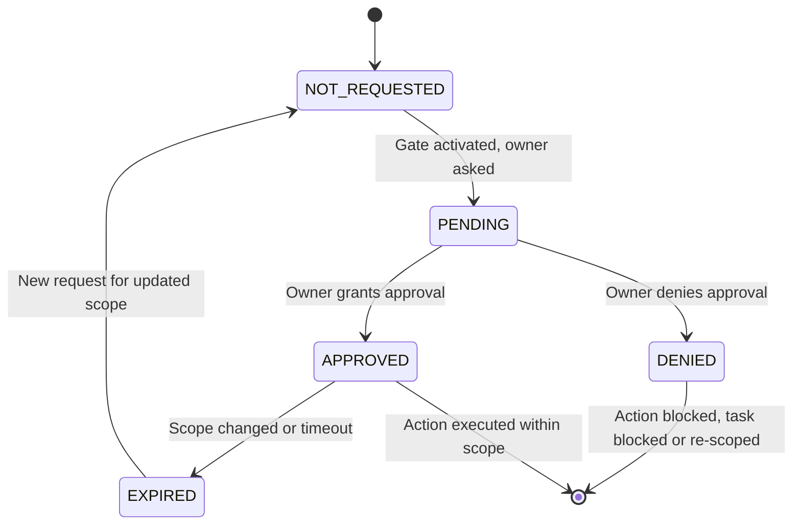

## When To Use

Use this skill before any irreversible or remote action. It is **mandatory** for all tasks classified as `HIGH_HUMAN_GATE` per the Risk Tier system in WORKING-METHOD.md.

Concrete triggers for loading this skill:

- Before applying file changes to the target project (`Apply Gate`)
- Before staging or committing changes (`Commit Gate`)
- Before pushing commits to a remote (`Push Gate`)
- Before creating a pull request (`PR Gate`)
- Before merging a pull request (`Merge Gate`)
- Before deploying to any environment (`Deploy Gate`)
- Before enabling or executing remote CI workflows (`Remote CI Gate`)
- Before creating or modifying skill files (`Skill Write Gate`)
- Before writing to agent memory stores (`Memory Write Gate`)

When any of the above actions is planned, load this skill first to manage the approval lifecycle. Do not proceed with the action until the corresponding gate is `APPROVED`.

---

## The 9 Approval Gates

Each gate governs one concrete action. All gates follow the same approval state machine and core rules. Approval is never transferable between gates.

### 1. Apply Gate

| Property | Value |
|----------|-------|
| **Name** | Apply |
| **Description** | Controls whether file changes may be written to the target project (local filesystem). |
| **When required** | Before any `write`, `edit`, or filesystem mutation in the target project directory. |
| **What scope covers** | Specific file paths and the nature of changes (create, modify, delete). The scope must be declared before requesting approval. |
| **How approval is obtained** | Present the scope (list of files, type of changes, risk summary) to the owner. Wait for explicit confirmation. |
| **What happens when denied** | No file writes are performed. The task remains in `WARM` context. Document the denial reason. |

### 2. Commit Gate

| Property | Value |
|----------|-------|
| **Name** | Commit |
| **Description** | Controls whether changes may be committed to the local git repository. |
| **When required** | Before `git commit` or any equivalent action that creates a local commit. |
| **What scope covers** | The set of staged changes, commit message content, and author metadata. |
| **How approval is obtained** | Present the diff summary, commit message draft, and list of changed files to the owner. |
| **What happens when denied** | No commit is created. Changes remain unstaged or staged but uncommitted. |

### 3. Push Gate

| Property | Value |
|----------|-------|
| **Name** | Push |
| **Description** | Controls whether local commits may be pushed to a remote repository. |
| **When required** | Before `git push` or any equivalent action that transmits commits to a remote. |
| **What scope covers** | The target remote URL, branch name, and the set of commits being pushed. |
| **How approval is obtained** | Present the remote URL, branch, commit range/summary, and any associated PR reference. |
| **What happens when denied** | No push occurs. Commits remain local only. |

### 4. PR Gate

| Property | Value |
|----------|-------|
| **Name** | PR |
| **Description** | Controls whether a pull request or merge request may be created. |
| **When required** | Before creating a pull request on any platform (GitHub, GitLab, etc.). |
| **What scope covers** | Source branch, target branch, PR title, description, and reviewer assignments. |
| **How approval is obtained** | Present the full PR draft (title, description, diff summary, related issue references). |
| **What happens when denied** | No PR is created. Changes remain in the local branch. |

### 5. Merge Gate

| Property | Value |
|----------|-------|
| **Name** | Merge |
| **Description** | Controls whether a pull request may be merged. |
| **When required** | Before merging any PR or branch into a target branch (especially `main`, `master`, or `production`). |
| **What scope covers** | The source and target branches, merge strategy, and any post-merge actions. |
| **How approval is obtained** | Present the PR status, CI results (if any), review status, and diff summary. |
| **What happens when denied** | The PR remains open and unmerged. No branch is updated. |

### 6. Deploy Gate

| Property | Value |
|----------|-------|
| **Name** | Deploy |
| **Description** | Controls whether a deployment to any environment (staging, production) may proceed. |
| **When required** | Before any deployment action (docker compose up, npm publish, cloud deploy, etc.). |
| **What scope covers** | Target environment, deployment method, version/release identifier, rollback plan. |
| **How approval is obtained** | Present deployment plan, rollback strategy, verification steps, and risk assessment. |
| **What happens when denied** | No deployment is executed. The artifact remains undeployed. |

### 7. Remote CI Gate

| Property | Value |
|----------|-------|
| **Name** | Remote CI |
| **Description** | Controls whether remote CI workflows may be copied, enabled, or executed. |
| **When required** | Before enabling any CI workflow, copying workflow files, or triggering a remote CI run. |
| **What scope covers** | Specific workflow files, triggers, secrets, and permissions. |
| **How approval is obtained** | Present the list of workflow files, cost analysis, secret exposure assessment, and permission requirements. |
| **What happens when denied** | Workflow files remain disabled or are not copied. No remote CI runs. |

### 8. Skill Write Gate

| Property | Value |
|----------|-------|
| **Name** | Skill Write |
| **Description** | Controls whether agent skill files (SKILL.md) may be created or modified. |
| **When required** | Before writing or editing any `.opencode/skills/*/SKILL.md` file. |
| **What scope covers** | Skill name, description, all sections, and metadata. |
| **How approval is obtained** | Present the skill scope, purpose, and full content proposal. |
| **What happens when denied** | No skill file is created or modified. |

### 9. Memory Write Gate

| Property | Value |
|----------|-------|
| **Name** | Memory Write |
| **Description** | Controls whether agent memory files (`.opencode/memory/`) may be written or updated. |
| **When required** | Before writing any data to agent memory stores. |
| **What scope covers** | Memory file paths, data content, purpose, and retention implications. |
| **How approval is obtained** | Present what data will be stored, for what purpose, and for how long. |
| **What happens when denied** | No memory write occurs. Data remains transient or is discarded. |

---

## Approval State Machine

All nine gates share the same state machine:

```
NOT_REQUESTED → PENDING → APPROVED | DENIED | EXPIRED
```

### State Descriptions

| State | Meaning |
|-------|---------|
| **NOT_REQUESTED** | The gate has not been activated yet. No approval has been sought. |
| **PENDING** | Approval has been requested from the owner. Waiting for a response. |
| **APPROVED** | The owner has explicitly approved the gate for the declared scope. Includes timestamp and scope record. |
| **DENIED** | The owner has explicitly denied the gate, optionally with a reason. |
| **EXPIRED** | A previous `APPROVED` state is no longer valid. Occurs when scope changes or a timeout is reached. |

### State Transition Diagram



### Transition Rules

1. `NOT_REQUESTED → PENDING`: Only when all prerequisites for the action are met (spec, plan, tests, security/compliance review if applicable).
2. `PENDING → APPROVED`: Only by explicit owner confirmation. Silence is never approval.
3. `PENDING → DENIED`: Owner explicitly says no. The denial reason must be documented.
4. `APPROVED → EXPIRED`: Automatic on scope change or after a configurable timeout (default: session scope, or 24 hours).
5. `EXPIRED → NOT_REQUESTED`: A new request can be made for a revised scope.
6. `DENIED` is a terminal state for the current scope. Re-requesting with the same scope is not allowed; scope must change or reason must be addressed.

---

## Core Rules

These five rules come from the Owner Approval Gates section in WORKING-METHOD.md and are binding for all nine gates.

### Rule 1: Action-Specific

Each gate applies **only** to its concrete action. The Apply Gate governs file writes, not commits. The Commit Gate governs commits, not pushes. A gate's approval never extends to any other action.

### Rule 2: Scope-Specific

Approval covers **only** the defined scope that was presented when the gate was requested. If the scope changes (different files, wider changes, different branch, different environment), the gate returns to `NOT_REQUESTED` and must be re-requested.

### Rule 3: Non-Transferable

Commit approval does **not** cover Push. Push approval does **not** cover PR. Each gate must be independently requested and approved. No gate's approval can be derived from another gate's approval.

### Rule 4: Not Derivable from Earlier Chats

Approvals from previous sessions, earlier chats, or different tasks are **never** sufficient. Every gate must be verified and explicitly approved in the **current session** for the **current scope**. Past approvals are irrelevant.

### Rule 5: Re-Approval on Scope Change

If the scope of an approved gate expands or changes in any material way, the gate transitions to `EXPIRED` and a new approval must be requested. Minor clarifications do not require re-approval; any addition of files, changes in branch, or different environment does.

---

## Workflow

Follow these five steps for each gate. Do not combine or skip steps.

### Step 1: Identify Which Gates Are Needed

Analyze the current task and planned actions. Determine which of the nine gates apply:

- Will files be written? → Apply Gate
- Will changes be committed? → Commit Gate
- Will commits be pushed? → Push Gate
- Will a PR be created? → PR Gate
- Will a PR be merged? → Merge Gate
- Will a deployment happen? → Deploy Gate
- Will remote CI be enabled or run? → Remote CI Gate
- Will skill files be created or modified? → Skill Write Gate
- Will memory be written? → Memory Write Gate

Record the result in the Owner Approval Status table.

### Step 2: Check Current State for Each Gate

For each identified gate, check its current state in the Owner Approval Status table:

- If `NOT_REQUESTED`: proceed to Step 3.
- If `PENDING`: proceed to Step 4.
- If `APPROVED`: verify scope still matches current task. If scope changed, transition to `EXPIRED` and go to Step 3.
- If `DENIED`: determine whether scope or conditions have changed sufficiently to request again. If not, the task is blocked.
- If `EXPIRED`: proceed to Step 3 for re-request with updated scope.

### Step 3: Request Approval (when NOT_REQUESTED)

For each gate in `NOT_REQUESTED` state:

1. Prepare the scope description (see Inputs section).
2. Present the scope to the owner with a clear request for approval.
3. State what action will be taken and what the scope boundaries are.
4. Wait for explicit owner response.
5. On explicit `APPROVED`: update status to `APPROVED` with timestamp.
6. On explicit `DENIED`: update status to `DENIED` with reason.

**Important**: Never assume silence means approval. Never proceed while the gate is `NOT_REQUESTED`.

### Step 4: Wait When PENDING

For each gate in `PENDING` state:

1. Do **not** proceed with the action.
2. Inform the owner that approval is still pending.
3. Re-present the scope if needed.
4. Only proceed when the gate transitions to `APPROVED`.

### Step 5: Proceed When APPROVED

For each gate in `APPROVED` state:

1. Confirm the current scope still matches the scope that was approved.
2. Execute the action.
3. After execution, transition the gate status to `EXECUTED` (informal terminal state for record-keeping).

If the scope changed between approval and execution, stop and treat as `EXPIRED`.

---

## Inputs

The following inputs are required for each gate approval request:

### Common Inputs (all gates)

| Input | Description |
|-------|-------------|
| Task scope | Description of the overall task and its boundaries |
| Risk tier | `LOW_LOCAL`, `MEDIUM_REVIEW`, `HIGH_HUMAN_GATE`, or `CRITICAL_BLOCK` |
| Planned actions | List of concrete actions planned (one per gate) |

### Gate-Specific Inputs

| Gate | Additional Inputs Required |
|------|---------------------------|
| Apply | File paths, change types (create/modify/delete), diff summary |
| Commit | Diff summary, commit message draft, author info |
| Push | Remote URL, branch name, commit range |
| PR | Source/target branches, title, description, reviewer list, issue references |
| Merge | Source/target branches, merge strategy, CI status, review status |
| Deploy | Target environment, deploy method, version, rollback plan, verification steps |
| Remote CI | Workflow file list, trigger events, secrets needed, permissions |
| Skill Write | Skill name, description, all sections, metadata |
| Memory Write | Memory file paths, data content, purpose, retention period |

---

## Outputs

### Gate Status Table

The primary output is the populated Owner Approval Status table (see template below), including current state, scope, request timestamp, and approval timestamp for each gate.

### Approval Record

Each approval event must be recorded with:

- Gate name
- Scope at time of approval
- Timestamp of request
- Timestamp of approval/denial
- Owner identifier (if available)
- Current state

### Task Guidance

Based on gate states, the skill outputs guidance:

- All required gates `APPROVED` → Proceed with execution.
- Any required gate `DENIED` → Task is blocked. Document reason.
- Any required gate `PENDING` → Wait for owner response.
- Any required gate `NOT_REQUESTED` → Request approval before proceeding.

---

## Security Boundaries

1. **Never bypass gates.** No gate may be skipped, overridden, or assumed. Every gate must be explicitly requested and approved in the current session. There is no "emergency override" for owner approval gates.

2. **Never assume approval from context.** Do not infer approval from:
   - Earlier chats or sessions (Rule 4)
   - Approval of a different gate (Rule 3)
   - Silence or lack of objection
   - The owner's general instructions or project rules
   - Ambient authority of the running session

3. **Always document approval status.** The Owner Approval Status table must be maintained and visible throughout the task. Approval decisions must be recorded with timestamps and scope descriptions.

4. **Re-verify on context change.** If the session context changes (task switch, provider change, model change, timeout), all `APPROVED` gates transition to `EXPIRED` and must be re-requested.

5. **No automated approval chains.** No gate may automatically trigger another gate's approval. Each gate is an independent owner decision.

6. **Scope integrity.** If a gate is approved for a narrow scope and the task expands, the gate expires immediately. The owner must approve the expanded scope explicitly.

7. **Audit trail.** All gate state transitions must be logged. The audit trail must include: gate name, previous state, new state, timestamp, scope, and owner decision (if applicable).

---

## Completion Criteria

- **All required gates** are in `APPROVED` state for the current scope, **or**
- **No required gate is in `DENIED` state** and the task scope does not trigger any gate, **or**
- The task is explicitly **blocked** with at least one `DENIED` gate and the owner has been informed.

### Gate-Specific Completion Conditions

| Gate | Completion Condition |
|------|---------------------|
| Apply | Files written within approved scope |
| Commit | Commit created within approved scope |
| Push | Push completed to approved remote/branch |
| PR | PR created with approved parameters |
| Merge | PR merged into approved target branch |
| Deploy | Deployment executed in approved environment |
| Remote CI | Workflow enabled/run with approved settings |
| Skill Write | Skill file created/updated within approved scope |
| Memory Write | Memory written within approved scope |

### Blocked Task Indicators

- A required gate is `DENIED` and the blocker has not been resolved.
- A required gate is `PENDING` for an extended period (no owner response).
- The scope has changed after approval and re-approval was denied.

---

## Owner Approval Status

```markdown
## Owner Approval Status
| Gate | Status | Scope | Requested | Approved |
|------|--------|-------|-----------|----------|
| Apply | NOT_REQUESTED | — | — | — |
| Commit | NOT_REQUESTED | — | — | — |
| Push | NOT_REQUESTED | — | — | — |
| PR | NOT_REQUESTED | — | — | — |
| Merge | DENIED | This run | — | — |
| Deploy | NOT_REQUESTED | — | — | — |
| Remote CI | NOT_REQUESTED | — | — | — |
| Skill Write | NOT_REQUESTED | — | — | — |
| Memory Write | NOT_REQUESTED | — | — | — |
```

Usage: Copy this table into the task's run card or working document. Update the Status, Scope, Requested, and Approved columns as gates transition through their states. The `Merge` gate defaults to `DENIED` for this run (agents never merge autonomously per write-protection.json).
