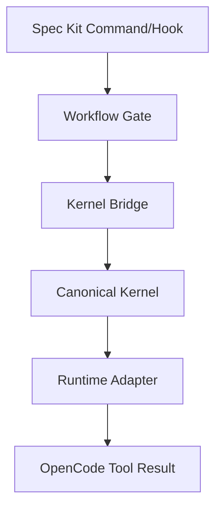

# Architektur: Spec-Kit-Integration

## Boundary (`STRUCTURAL`)

Spec Kit liefert Commands, Templates, Workflows und Evidence-Orchestrierung.
`scripts/lib/gates/` ist die einzige Quelle für Gate-Entscheidungen. Die
Bridge adaptiert CLI, JSON und Exit-Codes; sie dupliziert keine Gate-Regeln.



## Enforcement (`RUNTIME_VERIFIED`)

```yaml
enforcement:
  extension_hooks: advisory
  workflow_shell_gate: required
  runtime_kernel: authoritative
```

Ein realer OpenCode-Prozess forderte den RED-Sentinel über den `bash`-
Toolpfad an. Der Adapter klassifizierte `RED_BLOCK`, meldete die Kernel-Gates
`NO_FORCE_PUSH` und `NO_REMOTE_ACTION_WITHOUT_SCOPED_APPROVAL` und führte den
Seiteneffekt nicht aus. Ein zweiter Prozess bestätigte denselben Block.
Evidence: `evidence/spec-kit-closure-20260720T103548Z/12–14`.

Der Upstream führt Workflow-Shell-Schritte mit `shell=True` aus. Deshalb werden
keine dynamischen Benutzereingaben in Shell-Strings eingebettet; die statische
Workflow-Zeile ruft eine Node-Launcher-Datei auf, die die Bridge mit argv und
`shell:false` startet. Das ersetzt nicht die Kernel-Entscheidung.

## Approval (`LOCALLY_TESTED`)

Receipts binden Repository, kanonischen Projektpfad, Branch, full HEAD, Phase,
Aktion, Scope, Risk Tier und Lebenszyklus. Verbrauch wird project-local,
atomar und restart-persistent markiert. Der Mechanismus ist lokale
Tamper-Erkennung, keine kryptografische Owner-Authentisierung; dieser Trust
Boundary ist in Evidence 06 und im Security Review offengelegt.

## Catalog/Bundle (`NATIVE_VERIFIED` / `PROJECT_LAYER_VERIFIED` / `TOOL_GAP`)

Der lokale Catalog sowie die Manifest-Validierung sind `NATIVE_VERIFIED`.
Extension-/Preset-SHA-Prüfung und die getestete Entfernung/Reinstallation
bundle-owned Komponenten sind `PROJECT_LAYER_VERIFIED`. Workflow-Delegation,
Bundle-Update, Bundle-Archiv-SHA und atomarer Downgrade/Rollback bleiben
`TOOL_GAP_SPECKIT_0_13_BUNDLE_LIFECYCLE`; es gibt keine projektseitige
Compatibility Layer und keine unabhängige Bundle-Sicherheitsgrenze. Die
vollständige Matrix steht in
`evidence/spec-kit-assurance-20260720T193425Z/10-bundle-capability-matrix.md`.

## Credential boundary (`UPSTREAM_SECURITY_RISK` / `E2E_VERIFIED`)

`opencode debug config --print-logs --log-level DEBUG` kann in OpenCode 1.15.13
synthetische Credential-Werte als Teil der aufgelösten Konfiguration auf
stdout ausgeben. Dieser native Serializer liegt außerhalb des unterstützten
Projektscope und wird als reproduzierter `UPSTREAM_SECURITY_RISK` geführt;
globale OpenCode-Credential-Sicherheit wird nicht behauptet.
Projektkontrollierte Bridge-, Launcher-, Fehler-, JSON-, Plugin- und
Evidence-Ausgaben verwenden dagegen die zentrale Redaction-Hilfe; das ist
`E2E_VERIFIED` beziehungsweise `LOCALLY_TESTED`. Unbekanntes oder ungültiges
Bridge-JSON wird vor Ausgabe unterdrückt und als sichere `RED_BLOCK`-Antwort
repräsentiert. Die Redaction ist keine Korrektur des nativen OpenCode-
Diagnosepfads.
