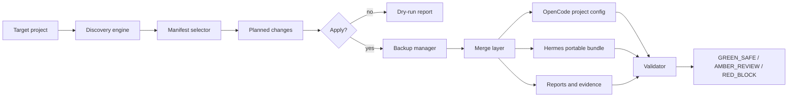

# Universal Bootstrap Architecture

## Summary

The repository becomes a manifest-driven bootstrap kit that analyzes a target project, selects a minimal safe set of OpenCode and Hermes artifacts, and applies them with backup and rollback support.

OpenCode remains the primary coding executor.
Hermes Agent is the orchestration and skill-runtime layer.

## Core Components

### 1. Manifest

`ecosystem.manifest.json` is the machine-readable source of truth for:

- supported runtimes
- supported operating systems
- discovery detectors
- agent and skill catalogs
- MCP trust tiers
- conflict strategy
- remote CI gating
- environment variables

### 2. Discovery Engine

`scripts/lib/discovery.mjs` inspects the target project and extracts:

- language and framework
- package manager
- tests, linters, and formatters
- Docker, database, and migration signals
- existing OpenCode and Hermes artifacts
- Git remote / GitHub remote detection
- PII and civic-tech signals
- offline or local-only constraints
- monorepo layout

The engine never reads secret contents.

### 3. Selector

`scripts/lib/manifest.mjs` maps discovery signals to:

- bootstrap skills
- agent recommendations
- MCP candidates
- policy overlays
- remote CI proposals

### 4. Merge Layer

`scripts/lib/merge.mjs` and `scripts/lib/opencode.mjs` perform structural deep merges.

Rules:

- preserve user providers and models
- preserve existing custom MCPs
- disable new MCPs by default
- merge only managed sections for Markdown docs
- classify ambiguous conflicts as `AMBER_REVIEW`
- classify unsafe writes as `RED_BLOCK`

### 5. Backup And Rollback

`scripts/lib/backup.mjs` creates a timestamped backup before any write.

Rollback restores the backed-up files without touching unrelated project files.

### 6. Hermes Layer

`scripts/lib/hermes.mjs` generates project-local Hermes bundle assets:

- `.hermes.md`
- `.hermes/README.md`
- `.hermes/skills/README.md`
- `.hermes/skills/`
- `.hermes/bundles/`
- `.hermes/mcp/`

These files are portable and do not modify the user's global Hermes home directory.

### 7. OpenCode Layer

`scripts/lib/opencode.mjs` updates the project-local OpenCode config.

Rules:

- no hardcoded shell
- no forced provider
- no forced model choice if the project already defines one
- no automatic MCP activation
- no copy of remote CI unless explicitly requested

### 8. Validator

`scripts/validate-ecosystem.mjs` validates:

- manifest shape
- agent and skill frontmatter
- OpenCode config
- Hermes bundle assets
- documentation
- fixture completeness

## Data Flow

## OpenCode And Hermes Separation

- OpenCode writes the live project executor config.
- Hermes writes portable project-local bundle assets and handoff notes.
- Neither system is allowed to silently overwrite the other.
- Hermes may consume the same skill content, but the bootstrap keeps the files portable and explicit.

## Trust Boundaries

- Tier 0 MCPs are read-only and disabled by default.
- Tier 1 MCPs are sandboxed and only suggested after matching signals.
- Tier 2 MCPs require a human gate and are never auto-enabled.
- Remote CI is treated as proposal-only unless `--include-remote-ci` is present.

## Living Truth Mirror

The repository keeps three truth layers aligned:

1. machine-readable truth: manifest, validator output, discovery JSON
2. technical truth: architecture doc and ADR
3. user truth: README, BOOTSTRAP, troubleshooting, and examples

All three layers must be updated together when the bootstrap behavior changes.
