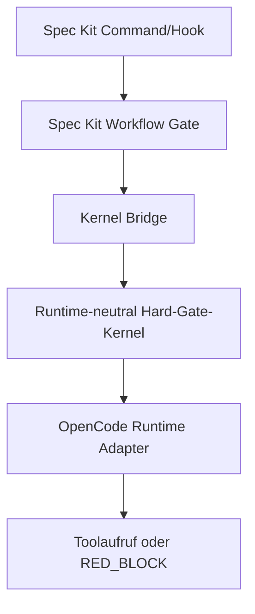

# Spec-Kit-Integration

Diese Integration verbindet Spec Kit 0.13.0 mit dem bestehenden,
runtime-neutralen Hard-Gate-Kernel. Spec Kit orchestriert; der Kernel bleibt
die autoritative Source of Truth für Allow/Deny-Entscheidungen.

## Abschlussstatus

`GREEN_SAFE`

Capability finding (not a project-wide blocker):
`TOOL_GAP_SPECKIT_0_13_BUNDLE_LIFECYCLE`

Capability-Stufen dieses Closure-Laufs:

| Capability | Stufe | Evidence |
|---|---|---|
| Extension, Preset, Workflow, Bundle-Struktur | `STRUCTURAL` | `integrations/spec-kit/` |
| Approval-Binding, Expiry, Replay, Race, Resume, Restart | `LOCALLY_TESTED` | `evidence/spec-kit-closure-20260720T103548Z/`; `17-focused-security-tests.txt` |
| Workflow-RED-Sentinel | `E2E_VERIFIED` | `evidence/spec-kit-closure-20260720T103548Z/` |
| echter OpenCode-Toolpfad blockiert RED | `RUNTIME_VERIFIED` | `19-runtime-tests.txt` |
| Projekt-Bridge, Launcher und Evidence-Writer redigieren Ausgaben | `E2E_VERIFIED` / `LOCALLY_TESTED` | Assurance Evidence `04–09`, `12–18` |
| native OpenCode-Diagnose redigiert Credentials | `UPSTREAM_SECURITY_RISK` / `NOT_SUPPORTED` | Assurance Evidence `04-native-opencode-leak.txt` |
| lokaler Catalog: Search/Info/Komponenten | `LOCALLY_TESTED` | `14-bundle-gap-classification.md`; `15-bundle-lifecycle-tests.txt` |
| Bundle-Update, Bundle-SHA und echter Bundle-Rollback | `TOOL_GAP` | `14–16-bundle-*` |

Der Runtime-Bypass ist damit nicht mehr unbewiesen. Der native OpenCode-
Diagnosepfad ist ausdrücklich kein unterstützter Projektpfad; der Projektcode
behauptet keine globale OpenCode-Credential-Sicherheit. Die projektkontrollierten
Bridge-, Launcher-, Fehler-, JSON- und Evidence-Ausgaben sind zentral redigiert
und durch Regressionstests abgedeckt. Der technisch getrennte Read-only-
Reviewer hat in Review v3 `APPROVED_WITH_FINDINGS` geliefert. Die Findings
betreffen die dokumentierte Upstream-Grenze, den Spec-Kit-Lifecycle-Tool-Gap
und lokal nicht verfügbare Lint-/Typecheck-/Format-Werkzeuge; sie sind keine
projektseitige Credential-Containment-Umgehung.

## Komponenten

- `extensions/opencode-evidence`: sieben OpenCode-Commands und advisory Hooks.
- `presets/opencode-canonical-method`: Spec-Kit-Command-Templates.
- `workflows/opencode-safe-delivery`: Shell-Gates und Human-Gates.
- `bundles/opencode-agent-ecosystem`: gepinnte Komponentenzusammenstellung.
- `catalogs/`: lokaler, nicht veröffentlichter Test-Catalog mit SHA-256-Feldern.

## Source-of-Truth-Grenze



Extension-Hooks sind `advisory`. Workflow-Shell-Gates sind erforderlich, aber
keine alleinige Sicherheitsgrenze. Der reale OpenCode-Toolpfad ruft den
Runtime-Adapter vor dem Seiteneffekt auf; die Kernel-Klassifikation bleibt
maßgeblich.

## Lokale Validierung

```bash
node --test
node scripts/validate-ecosystem.mjs
node --check scripts/evaluate-operation.mjs
```

Die Assurance-Matrix besteht mit 425/425 Tests; die 28 Redaction- und 12
Bridge-Contract-Tests decken die zusätzlichen Grenzen ab. ESLint, Prettier und TypeScript sind im Repository nicht
vollständig konfiguriert/verfügbar; siehe
`evidence/spec-kit-final-closure-20260720T183149Z/21-lint-typecheck-format.txt`.

## Bekannte Grenzen

Die vollständige Pfadmatrix steht in
`evidence/spec-kit-assurance-20260720T193425Z/02-supported-surface-inventory.md`.
Der native Befehl `opencode debug config --print-logs --log-level DEBUG` ist
als unsicherer Upstream-Diagnosepfad dokumentiert, aber nicht als Projektpfad
unterstützt. `$ARGUMENTS` wird vom Preflight-Command nicht mehr ausgegeben.

Spec Kit 0.13.0 delegiert Bundle-Workflows programmgesteuert mit einem
fehlerhaften Typer-Default und reicht beim Bundle-Refresh keinen sicheren
Overwrite-Pfad an die Extension-Primitive weiter. Außerdem wird ein
`sha256`-Feld des Bundle-Catalog-Eintrags vom Upstream-Bundle-Downloader nicht
verifiziert. Diese Grenzen sind reproduziert und werden als
`TOOL_GAP_SPECKIT_0_13_BUNDLE_LIFECYCLE` geführt. Es gibt keine projektseitige
Compatibility Layer; native Update-/Rollback-Garantien werden nicht behauptet.
